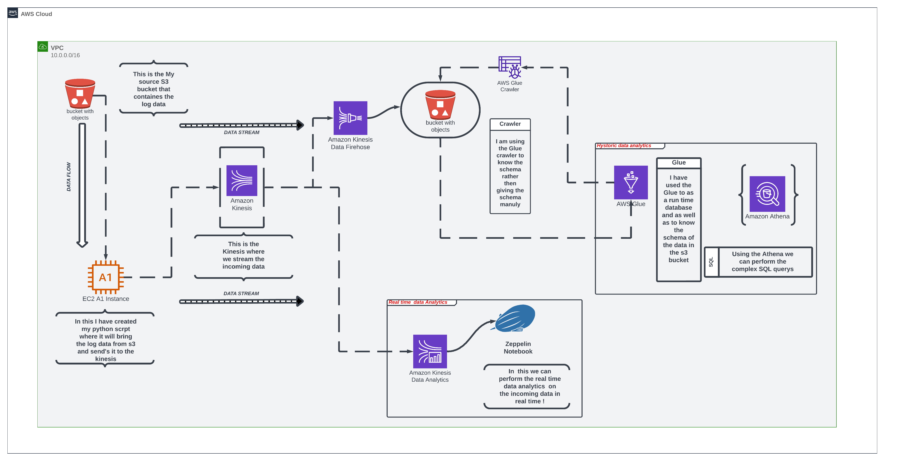

# 💎 This Project is to Demonstrate the Knowledge in  `Data Engineering Domain`.
>▮  This is a Real Time Log Aggregation and Analytics Project. 🦉


# 🌐 Socials :
[](https://behance.net/Vinay_kumar) [](https://instagram.com/knightkings77) [](https://linkedin.com/in/https://www.linkedin.com/in/vinaykumar77/) 


# 💻 Technoliges I have use in this project :
  
   


# 🗿 Flow Chart :
Here is the data pipeline :


# 🧩 Project Flow :

>Install Kafka and Spark !

>Create the account in the OpenWeatherMap Api.

>Watchout for the Dependencies Needed.

>Run your  `ZooKeeper Server` in your Local System.

                        $ bin/zookeeper-server-start.sh config/zookeeper.properties

>Start your `kafka Server` in your Local System.

                        $ bin/kafka-server-start.sh config/server.properties

>If you haven't created `topic` the create one

                        $ bin/kafka-topics.sh --create --topic <Topic_name> --bootstrap-server localhost:9092

>Open up the `producer` in other terminal or run the producer code  `Api_To_Kafka.py`  or  `Api_To_Kafka_With_Pyspark.py`

                        $ bin/kafka-console-producer.sh --broker-list localhost:9092 --topic <Topic_name>

>Now run the `Consumer Ap`p which will consume the data from that Topic or run the consumer code  `Kafka_To_Parquet.py` and `Parquet_To_MongoDB.py`

                        $ bin/kafka-console-consumer.sh --bootstrap-server localhost:9092 --topic <Topic_name> --from-beginning
 
>In this project, I have used MongoDB Atlas to store and view real-time data. 
>To integrate MongoDB with the locally running Spark job, you need to download the [`Spark-MongoDB Connector.`](https://www.mongodb.com/docs/spark-connector/current/).
>It is a JAR file that you can find in the provided link or on the [`Maven Dependencies`](https://mvnrepository.com/artifact/org.mongodb.spark/mongo-spark-connector) webpage.


# Project flow Steps :

```bash 
Real-Time-Data-Pipeline-Using-Kafka:.
|   README.md
|
+---dashboard
|       weather_api_project.pdf
|       
|
+---images
|       flow.png
|       
|
\---Main
        Api_To_Kafka.py
                        <`python3 Api_To_Kafka.py`>
        Kafka_To_Parquet.py
                        <`spark-submit   --packages org.apache.spark:spark-sql-kafka-0-10_2.12:3.5.0,
                          org.mongodb.spark:mongo-spark-connector_2.12:3.0.1   Kafka_To_Parquet.py`>
        Parquet_To_MongoDB.sh
                        <`spark-submit   --packages org.apache.spark:spark-sql-kafka-0-10_2.12:3.5.0,
                          org.mongodb.spark:mongo-spark-connector_2.12:3.0.1   Parquet_To_MongoDB.sh`>

|
\--- Option 
        Api_To_Kafka_With_Pyspark.py
                        <`spark-submit   --packages org.apache.spark:spark-sql-kafka-0-10_2.12:3.5.0 Parquet_To_MongoDB.sh`>
        
        
```
# 🦾 Data Structer That I Am Getting From The Api End_Point :
```json
{"coord": {"lon": 80.2785, "lat": 13.0878}, "weather": [{"id": 801, "main": "Clouds", "description": "few clouds", "icon": "02n"}], "base": "stations", "main": {"temp": 26.99, "feels_like": 29.18, "temp_min": 26.99, "temp_max": 26.99, "pressure": 1015, "humidity": 74}, "visibility": 6000, "wind": {"speed": 3.09, "deg": 100}, "clouds": {"all": 20}, "dt": 1706190397, "sys": {"type": 1, "id": 9218, "country": "IN", "sunrise": 1706144745, "sunset": 1706186156}, "timezone": 19800, "id": 1264527, "name": "Chennai", "cod": 200}
{"coord": {"lon": 88.3697, "lat": 22.5697}, "weather": [{"id": 721, "main": "Haze", "description": "haze", "icon": "50n"}], "base": "stations", "main": {"temp": 18.97, "feels_like": 18.8, "temp_min": 18.97, "temp_max": 18.97, "pressure": 1019, "humidity": 72}, "visibility": 2800, "wind": {"speed": 0, "deg": 0}, "clouds": {"all": 8}, "dt": 1706190115, "sys": {"type": 1, "id": 9114, "country": "IN", "sunrise": 1706143671, "sunset": 1706183347}, "timezone": 19800, "id": 1275004, "name": "Kolkata", "cod": 200}
{"coord": {"lon": 78.4744, "lat": 17.3753}, "weather": [{"id": 721, "main": "Haze", "description": "haze", "icon": "50n"}], "base": "stations", "main": {"temp": 25.23, "feels_like": 25.3, "temp_min": 24.73, "temp_max": 25.23, "pressure": 1018, "humidity": 57}, "visibility": 4000, "wind": {"speed": 3.09, "deg": 70}, "clouds": {"all": 40}, "dt": 1706190301, "sys": {"type": 1, "id": 9214, "country": "IN", "sunrise": 1706145559, "sunset": 1706186209}, "timezone": 19800, "id": 1269843, "name": "Hyderabad", "cod": 200}
{"coord": {"lon": 77.2167, "lat": 28.6667}, "weather": [{"id": 701, "main": "Mist", "description": "mist", "icon": "50n"}], "base": "stations", "main": {"temp": 13.95, "feels_like": 13.67, "temp_min": 13.95, "temp_max": 14.05, "pressure": 1021, "humidity": 87}, "visibility": 1200, "wind": {"speed": 1.54, "deg": 340}, "clouds": {"all": 20}, "dt": 1706190718, "sys": {"type": 2, "id": 145989, "country": "IN", "sunrise": 1706146968, "sunset": 1706185403}, "timezone": 19800, "id": 1273294, "name": "Delhi", "cod": 200}
{"coord": {"lon": 77.6033, "lat": 12.9762}, "weather": [{"id": 801, "main": "Clouds", "description": "few clouds", "icon": "02n"}], "base": "stations", "main": {"temp": 26.37, "feels_like": 26.37, "temp_min": 24.9, "temp_max": 26.79, "pressure": 1018, "humidity": 47}, "visibility": 6000, "wind": {"speed": 2.57, "deg": 100}, "clouds": {"all": 20}, "dt": 1706190458, "sys": {"type": 2, "id": 2017753, "country": "IN", "sunrise": 1706145378, "sunset": 1706186808}, "timezone": 19800, "id": 1277333, "name": "Bengaluru", "cod": 200}
```

# 🎰 Language Type :


# 😏 Acknowledgements
 - [Databricks](https://community.cloud.databricks.com/login.html)
 - [Spark](https://spark.apache.org/downloads.html)
 - [MongoDB Atlas](https://www.mongodb.com/atlas/database)
