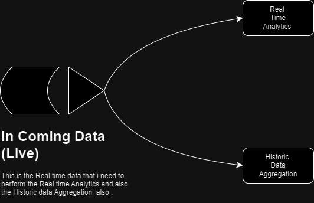

# 💎 This Project is to Demonstrate the Knowledge in  `Data Engineering Domain`.
>▮  This is a Real Time Log Aggregation and Analytics Project. 🦉


# 🌐 Socials :
[](https://behance.net/Vinay_kumar) [](https://instagram.com/knightkings77) [](https://linkedin.com/in/https://www.linkedin.com/in/vinaykumar77/) 


# 💻 Technoliges I have use in this project :
  
   


# 🗿 Flow Chart :
Here is the data pipeline :


# 🧩 Project Flow :

>First follow the project flow given in the Document !

>Create the account in the AWS.

>Try to find the better suited Dataset.

>## I am Doing the real time analytics on the live data and also Aggregation operations on the historic data too.

   

>## First Choose the source of your incoming Data .

  ### 1) LogGeneraterToConsole.py
> This above file will generate the log by it self and showes the data on the console (It is a fake data !)
       
  ### 3) S10.py
> This above file is used to fetch the data from the s3 in aws where i have stored the real web server logs of a website this
       Dataset (3.6 GB) is available in kaggle.
       
  ### 4) logGenerater.py
> This above file will generate the `fake log data` and pushes that data into the end point !
       
  ### 6) LambdaFunctionAWS.py
> This above file is a lambda function where i am trying to convert the log data in to the json format in real time `This is a real time data
  Transformations` in AWS
    
> NOTE:- The data that I am fetchinng from the dataset is `Semi - Structured Data`  For that reason i am transforming the data and also altering               that date of that data to make it as a real time log data 
 

# Project flow Steps :

```bash 
Real-Time-Log-Aggregation-And-Analytics:.
|   README.md
|
+---dashboard
|       Log_Aggregation_And_Analysis.pdf
|       
|
+---images
|       Flow_diagram.png
|       ARC.drawio.png
|       
|
\---Main
        S10.py
                        <`S10.py`>
|
\--- Option 
        LambdaFunctionAWS.py
                        <`LambdaFunctionAWS`>
        LogGeneraterToConsole.py
                        <`LogGeneraterToConsole.py`>
        logGenerater.py
                        <`logGenerater.py`>
        
        
```
# 🦾 Data Structer That I Am Getting From The log dataset :
```Log
54.36.149.41 - - [22/Jan/2019:03:56:14 +0330] "GET /filter/27|13%20%D9%85%DA%AF%D8%A7%D9%BE%DB%8C%DA%A9%D8%B3%D9%84,27|%DA%A9%D9%85%D8%AA%D8%B1%20%D8%A7%D8%B2%205%20%D9%85%DA%AF%D8%A7%D9%BE%DB%8C%DA%A9%D8%B3%D9%84,p53 HTTP/1.1" 200 30577 "-" "Mozilla/5.0 (compatible; AhrefsBot/6.1; +http://ahrefs.com/robot/)" "-"
31.56.96.51 - - [22/Jan/2019:03:56:16 +0330] "GET /image/60844/productModel/200x200 HTTP/1.1" 200 5667 "https://www.zanbil.ir/m/filter/b113" "Mozilla/5.0 (Linux; Android 6.0; ALE-L21 Build/HuaweiALE-L21) AppleWebKit/537.36 (KHTML, like Gecko) Chrome/66.0.3359.158 Mobile Safari/537.36" "-"
31.56.96.51 - - [22/Jan/2019:03:56:16 +0330] "GET /image/61474/productModel/200x200 HTTP/1.1" 200 5379 "https://www.zanbil.ir/m/filter/b113" "Mozilla/5.0 (Linux; Android 6.0; ALE-L21 Build/HuaweiALE-L21) AppleWebKit/537.36 (KHTML, like Gecko) Chrome/66.0.3359.158 Mobile Safari/537.36" "-"
40.77.167.129 - - [22/Jan/2019:03:56:17 +0330] "GET /image/14925/productModel/100x100 HTTP/1.1" 200 1696 "-" "Mozilla/5.0 (compatible; bingbot/2.0; +http://www.bing.com/bingbot.htm)" "-"
91.99.72.15 - - [22/Jan/2019:03:56:17 +0330] "GET /product/31893/62100/%D8%B3%D8%B4%D9%88%D8%A7%D8%B1-%D8%AE%D8%A7%D9%86%DA%AF%DB%8C-%D9%BE%D8%B1%D9%86%D8%B3%D9%84%DB%8C-%D9%85%D8%AF%D9%84-PR257AT HTTP/1.1" 200 41483 "-" "Mozilla/5.0 (Windows NT 6.2; Win64; x64; rv:16.0)Gecko/16.0 Firefox/16.0" "-"
40.77.167.129 - - [22/Jan/2019:03:56:17 +0330] "GET /image/23488/productModel/150x150 HTTP/1.1" 200 2654 "-" "Mozilla/5.0 (compatible; bingbot/2.0; +http://www.bing.com/bingbot.htm)" "-"
40.77.167.129 - - [22/Jan/2019:03:56:18 +0330] "GET /image/45437/productModel/150x150 HTTP/1.1" 200 3688 "-" "Mozilla/5.0 (compatible; bingbot/2.0; +http://www.bing.com/bingbot.htm)" "-"
40.77.167.129 - - [22/Jan/2019:03:56:18 +0330] "GET /image/576/article/100x100 HTTP/1.1" 200 14776 "-" "Mozilla/5.0 (compatible; bingbot/2.0; +http://www.bing.com/bingbot.htm)" "-"
66.249.66.194 - - [22/Jan/2019:03:56:18 +0330] "GET /filter/b41,b665,c150%7C%D8%A8%D8%AE%D8%A7%D8%B1%D9%BE%D8%B2,p56 HTTP/1.1" 200 34277 "-" "Mozilla/5.0 (compatible; Googlebot/2.1; +http://www.google.com/bot.html)" "-"
40.77.167.129 - - [22/Jan/2019:03:56:18 +0330] "GET /image/57710/productModel/100x100 HTTP/1.1" 200 1695 "-" "Mozilla/5.0 (compatible; bingbot/2.0; +http://www.bing.com/bingbot.htm)" "-"
```

# 🎰 Language Type :


# 😏 Acknowledgements
 - [Kaggle](https://www.kaggle.com/datasets/eliasdabbas/web-server-access-logs)
 - [AWS](https://aws.amazon.com/free/?gclid=CjwKCAjw_LOwBhBFEiwAmSEQAbO6KI7EbmGUHHVLHBwKcIcjX0rr4Ykn1G7ln0ZSlJIWP2-oSkFk2RoCo7wQAvD_BwE&trk=14a4002d-4936-4343-8211-b5a150ca592b&sc_channel=ps&ef_id=CjwKCAjw_LOwBhBFEiwAmSEQAbO6KI7EbmGUHHVLHBwKcIcjX0rr4Ykn1G7ln0ZSlJIWP2-oSkFk2RoCo7wQAvD_BwE:G:s&s_kwcid=AL!4422!3!453325184782!e!!g!!aws!10712784856!111477279771&all-free-tier.sort-by=item.additionalFields.SortRank&all-free-tier.sort-order=asc&awsf.Free%20Tier%20Types=*all&awsf.Free%20Tier%20Categories=*all)

